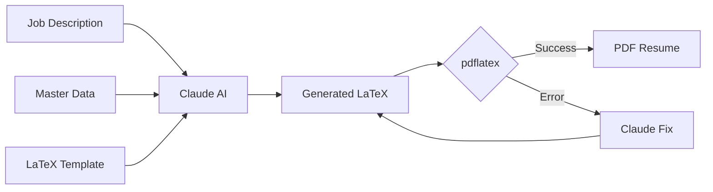

# Resume Generator Agent - Documentation

AI-powered CLI tool that generates tailored LaTeX resumes from job descriptions using Claude AI.

## Table of Contents

1. [Getting Started](./getting-started.md) - Installation and setup
2. [CLI Reference](./cli-reference.md) - All available commands
3. [Architecture](./architecture.md) - System design and flow diagrams
4. [Master Data Structure](./master-data.md) - Resume data format

## Quick Start

```bash
# Install dependencies
uv sync

# Set API key
export ANTHROPIC_API_KEY=your-key-here

# Generate a tailored resume for a job
uv run python agent.py generate -f jobs/backend-python.txt -o my-resume

# Generate complete CV (all experiences/skills)
uv run python agent.py complete

# Generate README.md
uv run python agent.py readme
```

## Features

| Feature | Description |
|---------|-------------|
| **AI-Tailored Resumes** | Claude analyzes job descriptions and selects relevant skills/experiences |
| **Complete CV Generation** | Generate full CV with all data (no LLM required) |
| **Single Source of Truth** | All CV data stored in `resume-master.json` |
| **Self-Healing LaTeX** | Automatically fixes compilation errors (up to 3 retries) |
| **Batch Processing** | Generate resumes for multiple jobs at once |
| **Interactive Mode** | Iterative refinement with feedback loop |
| **README Generation** | Auto-generate portfolio README from master data |
| **GitHub Actions** | Automatic CV and README generation on push |

## How It Works



## Project Structure

```
technical-resume/
├── agent.py                 # CLI entry point
├── src/
│   ├── llm_handler.py       # Claude AI integration
│   ├── latex_compiler.py    # pdflatex compilation
│   ├── latex_generator.py   # Complete CV LaTeX generation
│   ├── data_loader.py       # Master data loading
│   └── markdown_generator.py # README generation
├── data/
│   └── resume-master.json   # Your CV data (single source of truth)
├── templates/
│   ├── example.tex          # LaTeX template example
│   └── prompts/
│       └── system_prompt.txt
├── jobs/                    # Job description files
├── generated/               # Output PDFs
└── docs/                    # Documentation
```
