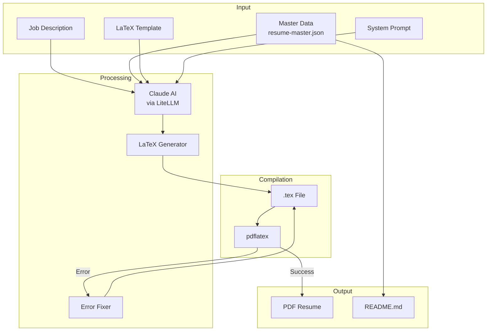
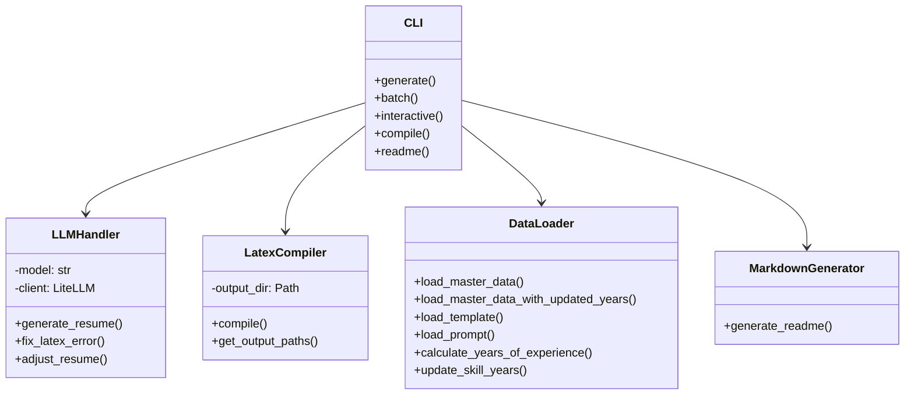
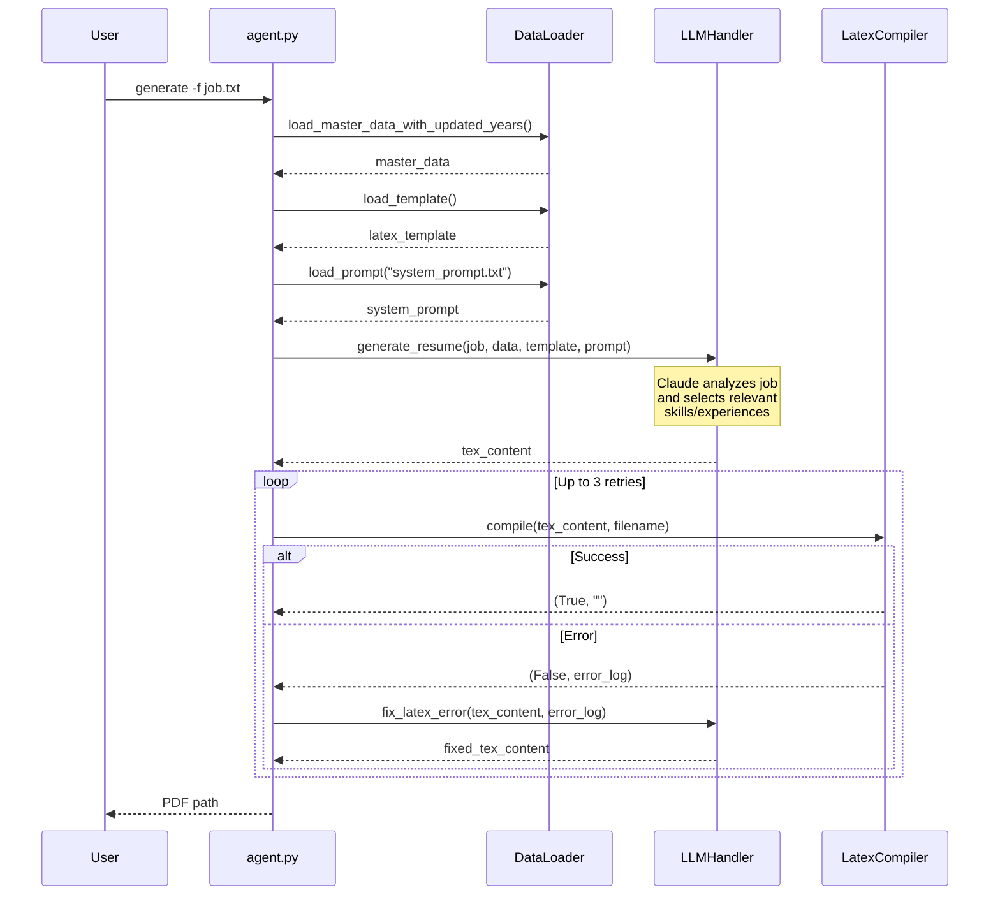
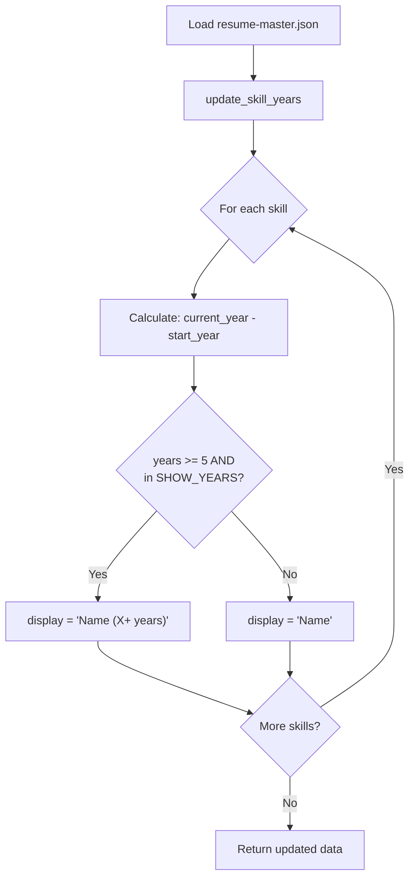
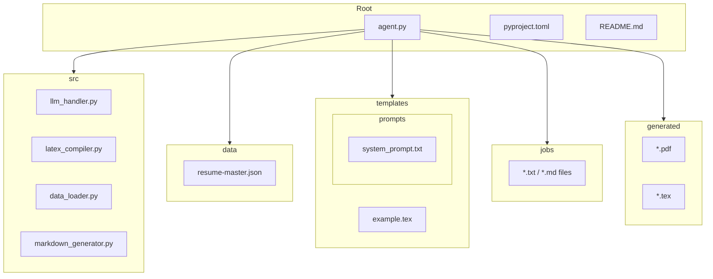
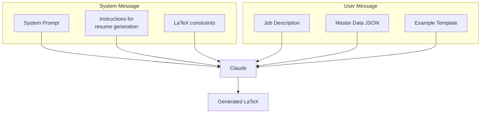
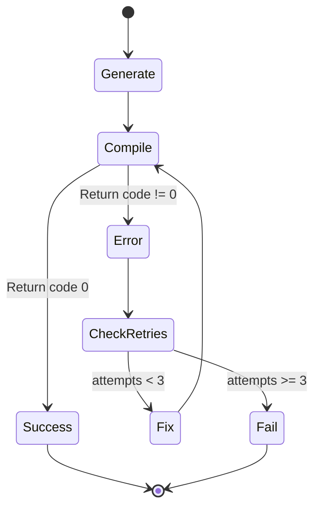

# Architecture

## System Overview

The Resume Generator Agent is a CLI tool that uses Claude AI to generate tailored LaTeX resumes from job descriptions.



## Component Architecture



## Data Flow

### Resume Generation Flow



### Years Calculation Flow



## File Structure



## LLM Integration

The system uses LiteLLM as an abstraction layer for Claude API:

```mermaid
flowchart LR
    subgraph Application
        LH[LLMHandler]
    end

    subgraph LiteLLM
        LL[LiteLLM Client]
    end

    subgraph Anthropic
        C[Claude API]
    end

    LH -->|completion()| LL
    LL -->|HTTP POST| C
    C -->|Response| LL
    LL -->|Parsed response| LH
```

### Prompt Structure



## Error Handling

### Self-Healing LaTeX Compilation



The error fixing process:
1. Capture pdflatex error log
2. Send error log to Claude with original LaTeX
3. Claude returns corrected LaTeX
4. Retry compilation
5. Repeat up to 3 times

## Key Design Decisions

### 1. Single Source of Truth
All CV data is stored in `resume-master.json`. The LLM selects and tailors content but never invents information.

### 2. Direct LaTeX Generation
The LLM generates LaTeX directly (no Jinja2 templating). This gives Claude full control over formatting and structure.

### 3. Dynamic Years Calculation
Skill years are calculated at runtime from `start_year` fields, ensuring the CV is always current.

### 4. Self-Healing Compilation
LaTeX errors are automatically fixed by Claude, reducing manual intervention.

### 5. Batch Processing
Multiple job applications can be processed in one command, streamlining the job search workflow.
