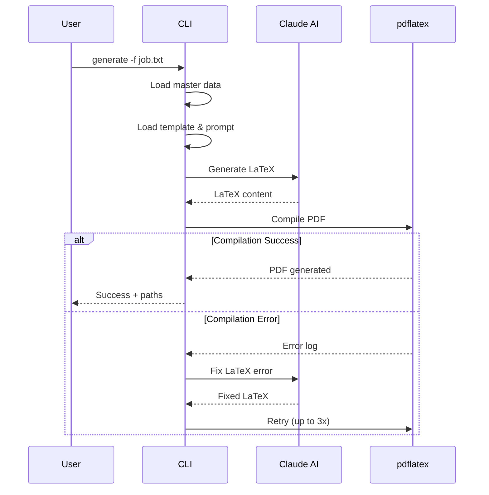
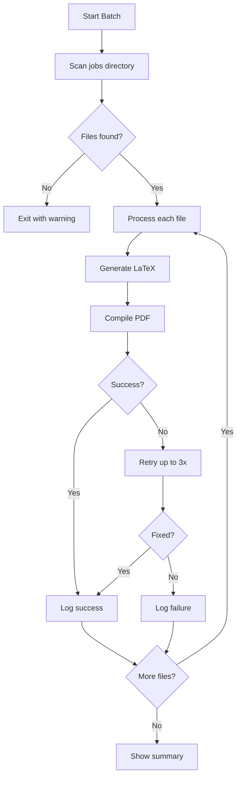
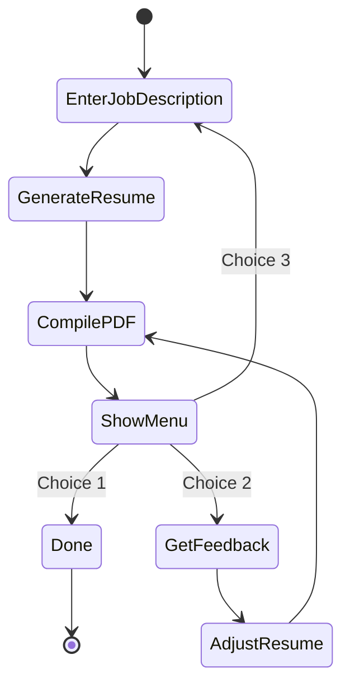

# CLI Reference

## Overview

The Resume Generator Agent provides several commands for generating and managing resumes.

```bash
uv run python agent.py [COMMAND] [OPTIONS]
```

## Commands

### generate

Generate a resume for a specific job description.

```bash
uv run python agent.py generate [JOB_DESCRIPTION] [OPTIONS]
```

**Arguments:**
| Argument | Description |
|----------|-------------|
| `JOB_DESCRIPTION` | Inline job description text (optional if using --job-file) |

**Options:**
| Option | Short | Default | Description |
|--------|-------|---------|-------------|
| `--job-file` | `-f` | - | Path to file with full job description |
| `--output` | `-o` | `resume-draft` | Output filename (without extension) |
| `--model` | `-m` | `anthropic/claude-sonnet-4-20250514` | LLM model to use |

**Examples:**

```bash
# From inline description
uv run python agent.py generate "Senior Python Developer at TechCorp"

# From job file
uv run python agent.py generate -f jobs/backend-python.txt -o backend-resume

# Using a different model
uv run python agent.py generate -f jobs/job.txt -m anthropic/claude-opus-4-20250514
```

**Flow:**



---

### batch

Generate resumes for all job files in a directory.

```bash
uv run python agent.py batch [OPTIONS]
```

**Options:**
| Option | Short | Default | Description |
|--------|-------|---------|-------------|
| `--jobs-dir` | `-d` | `jobs` | Directory containing job files |
| `--model` | `-m` | `anthropic/claude-sonnet-4-20250514` | LLM model to use |

**Examples:**

```bash
# Process all jobs in default directory
uv run python agent.py batch

# Process jobs from custom directory
uv run python agent.py batch -d my-applications/
```

**Supported file formats:** `.txt`, `.md`

**Flow:**



---

### interactive

Start an interactive session for iterative resume refinement.

```bash
uv run python agent.py interactive [OPTIONS]
```

**Options:**
| Option | Short | Default | Description |
|--------|-------|---------|-------------|
| `--model` | `-m` | `anthropic/claude-sonnet-4-20250514` | LLM model to use |

**Interactive Menu:**
1. **Done** - Keep current version and exit
2. **Adjust** - Provide feedback to modify the resume
3. **Regenerate** - Start fresh with a new job description

**Flow:**



---

### compile

Compile an existing `.tex` file to PDF.

```bash
uv run python agent.py compile TEX_FILE
```

**Arguments:**
| Argument | Description |
|----------|-------------|
| `TEX_FILE` | Path to the .tex file to compile |

**Examples:**

```bash
uv run python agent.py compile generated/my-resume.tex
```

---

### complete

Generate a complete CV with all experiences and skills (no LLM required).

```bash
uv run python agent.py complete [OPTIONS]
```

**Options:**
| Option | Short | Default | Description |
|--------|-------|---------|-------------|
| `--output` | `-o` | `complete-cv` | Output filename (without extension) |

**Examples:**

```bash
# Generate complete CV
uv run python agent.py complete

# Custom output name
uv run python agent.py complete -o my-full-resume
```

**Note:** This command generates a complete CV directly from `resume-master.json` without using an LLM. It includes all experiences, skills, projects, and education. This is used by GitHub Actions for automatic CV generation.

---

### readme

Generate README.md from master data.

```bash
uv run python agent.py readme [OPTIONS]
```

**Options:**
| Option | Short | Default | Description |
|--------|-------|---------|-------------|
| `--output` | `-o` | `README.md` | Output filename |

**Examples:**

```bash
# Generate default README.md
uv run python agent.py readme

# Generate to custom file
uv run python agent.py readme -o portfolio.md
```

---

## Environment Variables

| Variable | Required | Description |
|----------|----------|-------------|
| `ANTHROPIC_API_KEY` | Yes | Your Anthropic API key for Claude |

## Models

The `--model` option accepts any model supported by LiteLLM. Common options:

| Model | Description |
|-------|-------------|
| `anthropic/claude-sonnet-4-20250514` | Default, good balance of speed/quality |
| `anthropic/claude-opus-4-20250514` | Highest quality, slower |
| `anthropic/claude-haiku-3-5-20241022` | Fastest, lower quality |
