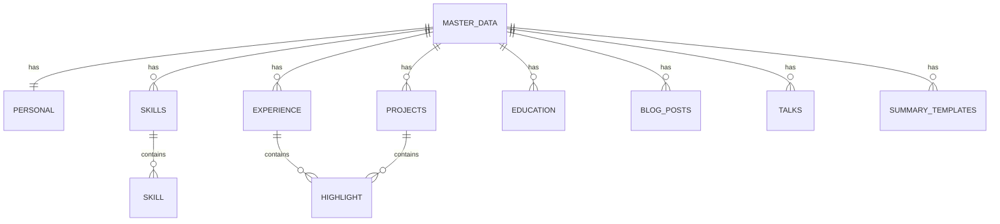
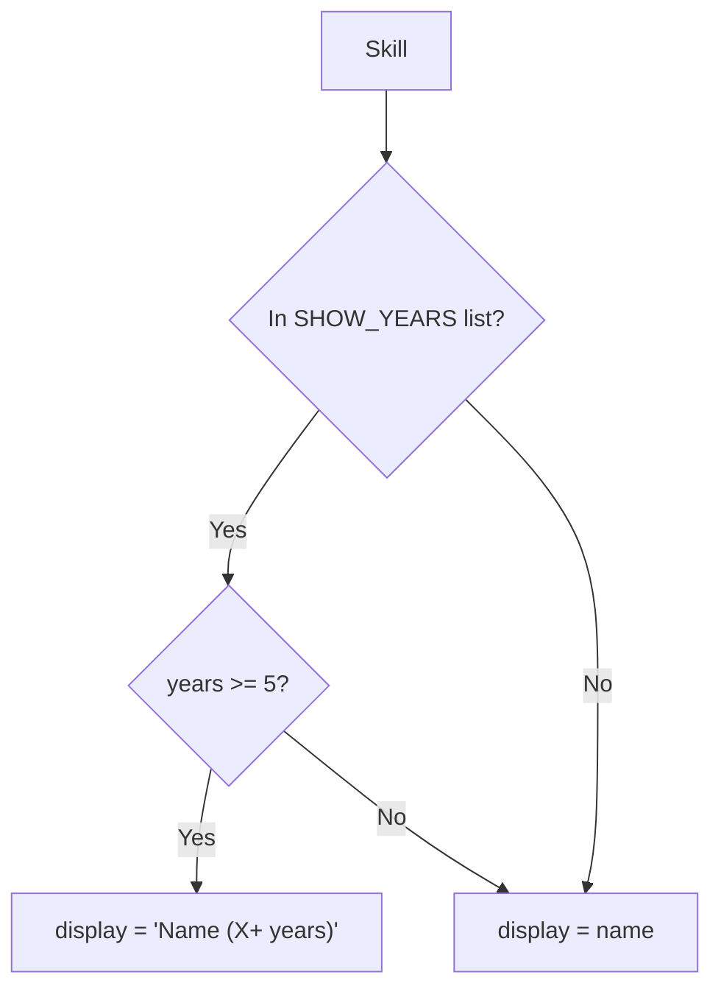

# Master Data Structure

The `resume-master.json` file is the single source of truth for all your CV data. The LLM uses this data to generate tailored resumes.

## Schema Overview



## Structure

### Root Object

```json
{
  "personal": { ... },
  "skills": { ... },
  "experience": [ ... ],
  "projects": [ ... ],
  "education": [ ... ],
  "blog_posts": [ ... ],
  "talks": [ ... ],
  "summary_templates": { ... }
}
```

---

## Personal Information

```json
{
  "personal": {
    "name": "Your Name",
    "email": "email@example.com",
    "links": {
      "calendar": "https://cal.com/...",
      "linkedin": "https://linkedin.com/in/...",
      "linkedin_handle": "yourhandle",
      "github": "https://github.com/...",
      "github_handle": "yourhandle",
      "website": "https://yoursite.com",
      "website_display": "yoursite.com"
    }
  }
}
```

| Field | Type | Description |
|-------|------|-------------|
| `name` | string | Full name |
| `email` | string | Contact email |
| `links` | object | Social/professional links |
| `links.*_handle` | string | Display handles for badges |

---

## Skills

Skills are organized by category. Each skill has metadata for filtering and display.

```json
{
  "skills": {
    "languages": [ ... ],
    "frontend": [ ... ],
    "backend": [ ... ],
    "ai_ml": [ ... ],
    "databases": [ ... ],
    "cloud_devops": [ ... ],
    "testing": [ ... ],
    "software_engineering": [ ... ],
    "mathematics": [ ... ],
    "soft_skills": [ ... ]
  }
}
```

### Skill Object

```json
{
  "name": "Python",
  "years": 8,
  "start_year": 2018,
  "level": "advanced",
  "categories": ["backend", "ai", "ml", "data", "fullstack"],
  "display": "Python (8+ years)"
}
```

| Field | Type | Description |
|-------|------|-------------|
| `name` | string | Technology name |
| `years` | number | Years of experience |
| `start_year` | number | Year you started using it |
| `level` | string | `beginner`, `intermediate`, `advanced`, `expert` |
| `categories` | array | Tags for filtering by job type |
| `display` | string | How it appears in the CV (auto-generated) |

### Years Display Logic



**SHOW_YEARS list:** Python, JavaScript, TypeScript, React.js, Next.js, Node.js

---

## Experience

```json
{
  "experience": [
    {
      "id": "company-2024",
      "title": "Job Title",
      "company": "Company Name",
      "location": "City, Country",
      "start_date": "2024-01-01",
      "end_date": null,
      "date_range": "Jan 2024 -- Present",
      "categories": ["ai", "fullstack", "backend"],
      "technologies": ["Python", "React", "AWS"],
      "highlights": [
        {
          "text": "Achievement or responsibility description",
          "categories": ["ai", "backend"]
        }
      ]
    }
  ]
}
```

| Field | Type | Description |
|-------|------|-------------|
| `id` | string | Unique identifier |
| `title` | string | Job title |
| `company` | string | Company name |
| `location` | string | Work location |
| `start_date` | string | ISO date (YYYY-MM-DD) |
| `end_date` | string\|null | ISO date or null if current |
| `date_range` | string | Display format (e.g., "Jan 2024 -- Present") |
| `categories` | array | Tags for filtering |
| `technologies` | array | Tech stack used |
| `highlights` | array | Achievements/responsibilities |

### Highlight Object

```json
{
  "text": "Built scalable APIs serving 1M+ requests/day",
  "categories": ["backend", "architecture", "performance"]
}
```

Categories help the LLM select relevant bullets for different job types.

---

## Projects

```json
{
  "projects": [
    {
      "id": "project-name",
      "name": "Project Name -- Subtitle",
      "url": "https://github.com/...",
      "categories": ["ai", "fullstack", "open-source"],
      "technologies": ["Python", "FastAPI", "React"],
      "stars": 150,
      "highlights": [
        {
          "text": "Description of what you built",
          "categories": ["ai", "backend"]
        }
      ]
    }
  ]
}
```

| Field | Type | Description |
|-------|------|-------------|
| `id` | string | Unique identifier |
| `name` | string | Project name with optional subtitle |
| `url` | string | Project URL (GitHub, demo, etc.) |
| `categories` | array | Tags for filtering |
| `technologies` | array | Tech stack |
| `stars` | number | GitHub stars (optional) |
| `highlights` | array | Key features/achievements |

---

## Education

```json
{
  "education": [
    {
      "id": "masters",
      "degree": "Master in Mathematics",
      "institution": "University Name",
      "location": "City, Country",
      "start_date": "2010-08-01",
      "end_date": "2013-09-01",
      "date_range": "Aug 2010 - Sep 2013",
      "categories": ["mathematics", "research"]
    }
  ]
}
```

---

## Blog Posts

```json
{
  "blog_posts": [
    {
      "id": "post-slug",
      "title": "Post Title",
      "url": "https://...",
      "date": "Sep 2024",
      "categories": ["ai", "ml", "nlp"],
      "description": "Brief description"
    }
  ]
}
```

---

## Talks

```json
{
  "talks": [
    {
      "id": "talk-2024",
      "title": "Talk Title -- Conference",
      "url": "https://youtube.com/...",
      "year": "2024",
      "event": "Conference Name",
      "categories": ["ai", "ml"],
      "highlights": [
        "Key point 1",
        "Key point 2"
      ]
    }
  ]
}
```

---

## Summary Templates

Pre-written professional summaries for different job types:

```json
{
  "summary_templates": {
    "fullstack": "Full Stack Developer with 7+ years...",
    "ai": "Machine Learning Engineer with 7+ years...",
    "frontend": "Frontend Developer with 7+ years...",
    "backend": "Backend Developer with 7+ years...",
    "blockchain": "Full Stack Developer with 7+ years in blockchain..."
  }
}
```

The LLM selects or adapts the most appropriate summary based on the job description.

---

## Categories Reference

Categories are used throughout to help the LLM filter relevant content:

| Category | Description |
|----------|-------------|
| `ai` | AI/ML related |
| `llm` | Large Language Models |
| `backend` | Server-side development |
| `frontend` | Client-side development |
| `fullstack` | Both frontend and backend |
| `blockchain` | Web3/crypto |
| `cloud` | Cloud platforms |
| `devops` | DevOps/infrastructure |
| `data` | Data engineering/science |
| `testing` | Testing/QA |
| `leadership` | Team lead/management |
| `architecture` | System design |

---

## Best Practices

### 1. Keep Data Current
Update `start_year` for skills. Years are calculated automatically at runtime.

### 2. Use Specific Categories
More specific categories help the LLM make better selections.

### 3. Write Impact-Focused Highlights
Use action verbs and quantify achievements:
- "Built X that resulted in Y"
- "Reduced Z by N%"
- "Led team of X developers"

### 4. Order by Relevance
Place most impressive/relevant items first in each array.

### 5. Maintain Consistency
Use consistent date formats, capitalization, and terminology.
